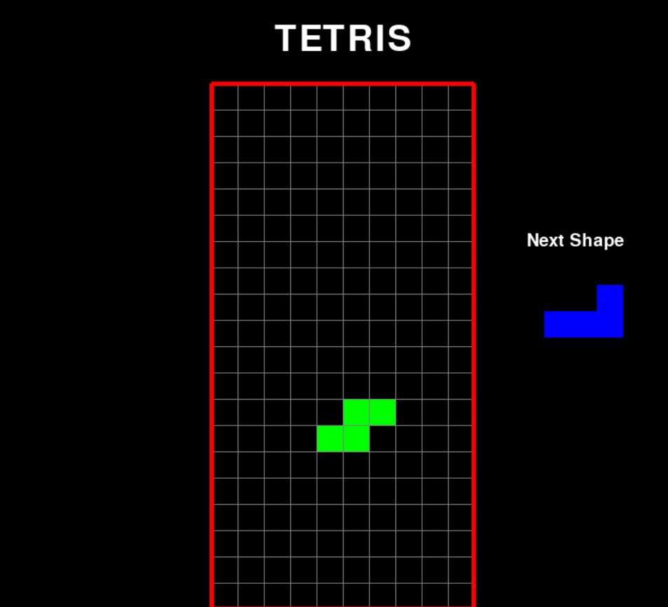

# Tetris-game
This is a retro and all-time famous game made using just Pygame.

## How to play
Use the package manager [pip](https://pip.pypa.io/en/stable/) to install Pygame.
```bash
pip install pygame
```

Start your game using
```bash
python script.py
```

## Screenshot

